# The All Dash

A command center for one project or one person. Feed it the documents you already
have — meeting notes, a calendar export, a transcript, a spreadsheet — and it
builds the dashboard from what it finds: tasks with owners and due dates, today's
agenda, decisions, risks, milestones, live metrics, reminders, and analytics that
say what needs attention.

Everything runs in the browser. Nothing is uploaded anywhere. There is no server,
no account, and no runtime dependency beyond React. An optional assistant answers
questions from your own data through a model you choose (Claude, any
OpenAI-compatible endpoint, or a local Ollama), cites the items it used, and
proposes changes for you to apply rather than making them.

```bash
npm install
npm run dev      # http://localhost:5173
npm test         # node:test, no browser needed; CI also runs it in three timezones
npm run build
```

Open it, click **Load a sample project**, and you get six documents run through
the real parsers — not fixture data.

## What it looks like

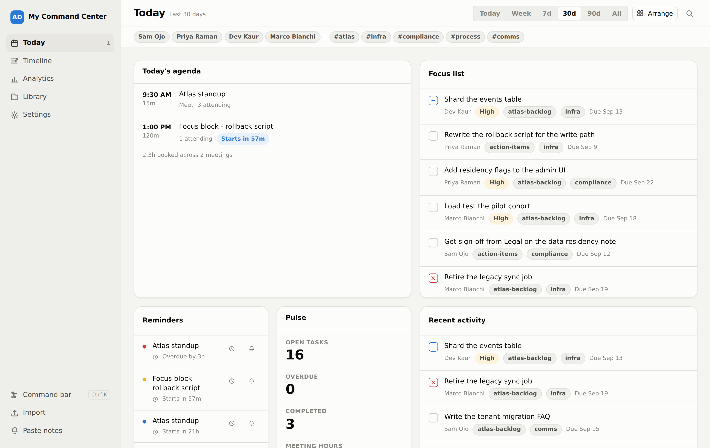

**Triage.** Everything that is wrong right now, most urgent first: overdue and
blocked work, milestones that passed with tasks still open, stalled items,
clashing meetings, off-target metrics. Each row carries the one or two buttons
that clear it, and a spark that asks the assistant why it was flagged.

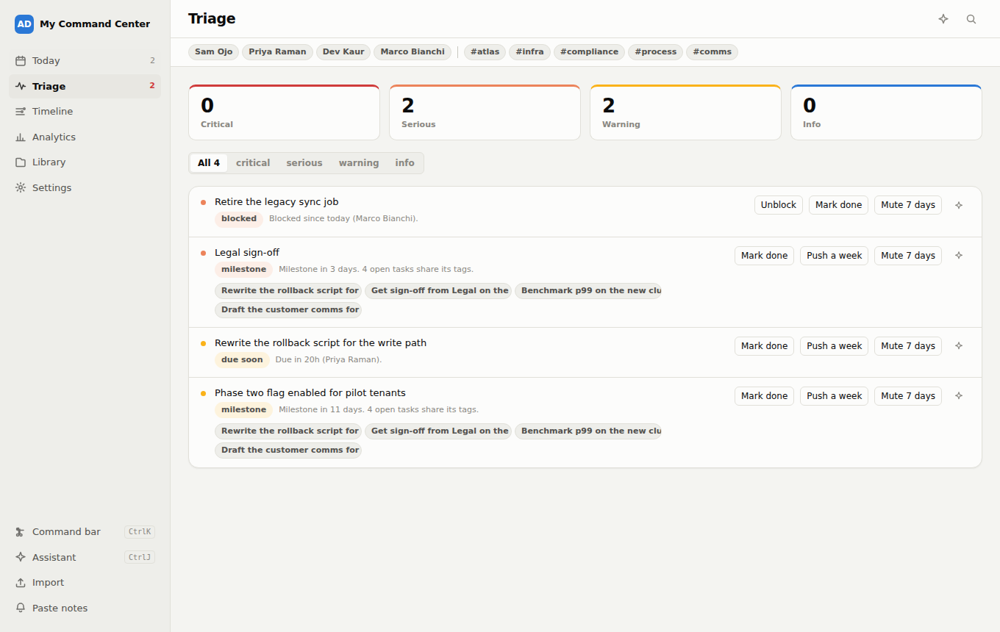

**Assistant.** Grounded in the live store, citing items as chips that open the
inspector. Ask for a change and it arrives as a proposal card with a before and
after; nothing is written until you press Apply.

<p>
  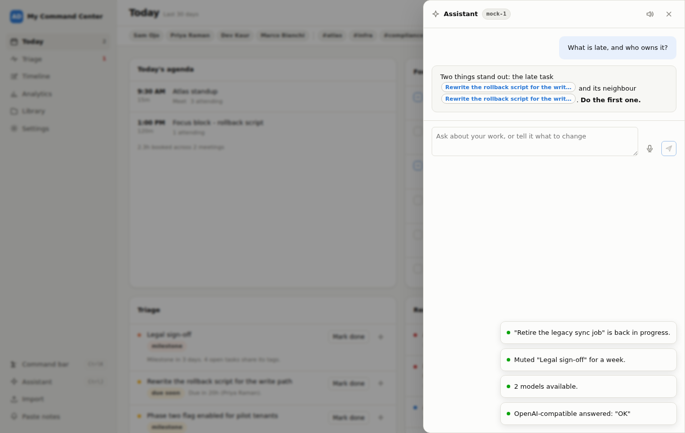
  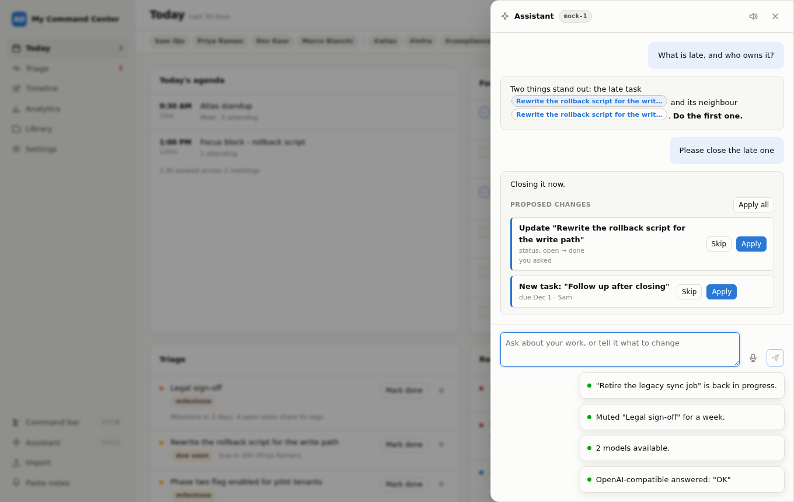
</p>

**Relationship map and load heatmap.** Documents on the left, the work they
produced in the middle, the people carrying it on the right; hover a node to
trace its thread. Below it, open tasks per person across the coming weeks.

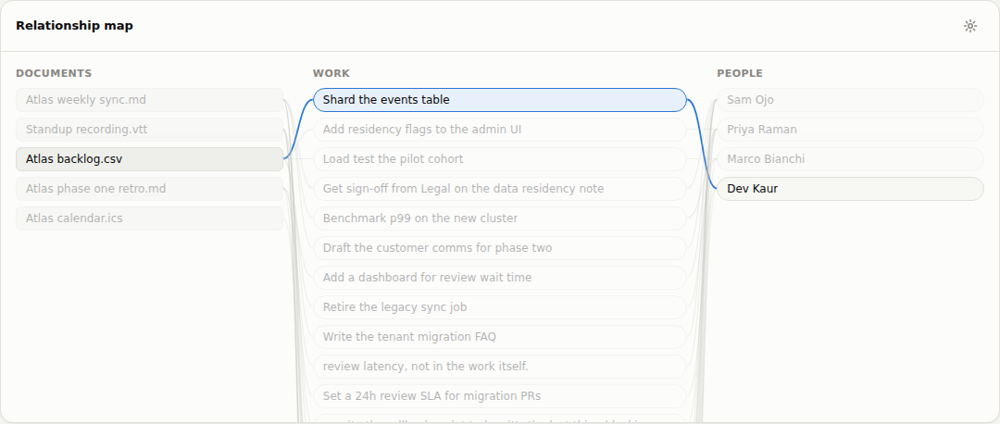

**Analytics.** Every metric on one wall — built-in, discovered from spreadsheet
columns, or built by hand — with sparklines and period-over-period deltas, then
any series as a line with a 7-day average.

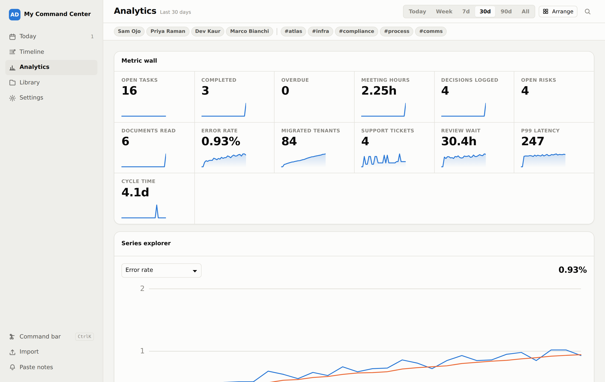

**Timeline.** Meetings on their start time, tasks and milestones on their due
date, one vertical run of days.

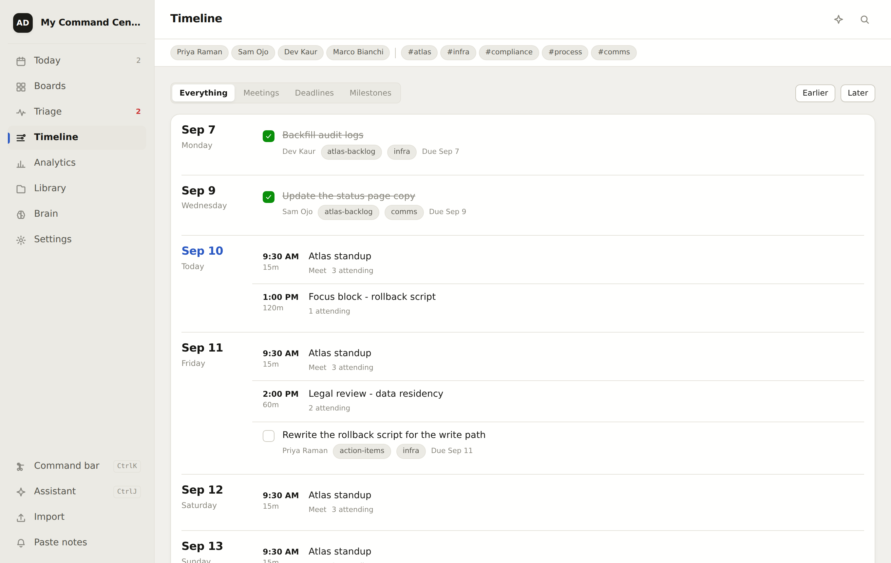

**Command bar and inspector.** `⌘K` searches every item and every command at
once. Click anything to open it, edit it, and see what else came from the same
document.

<p>
  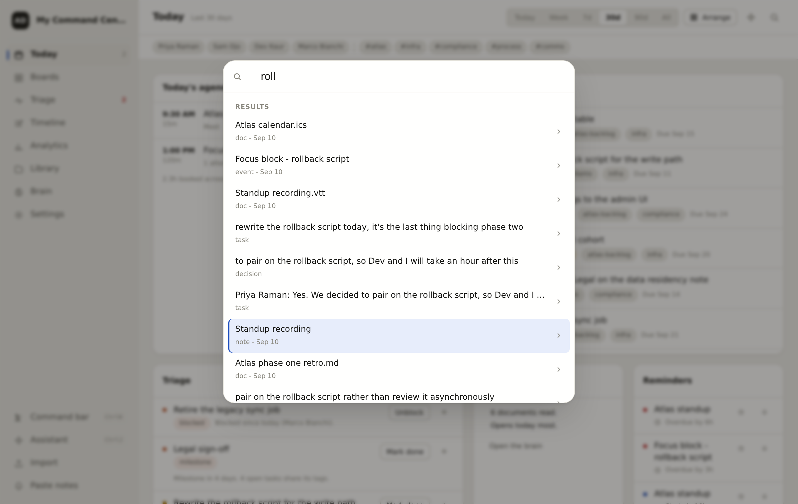
  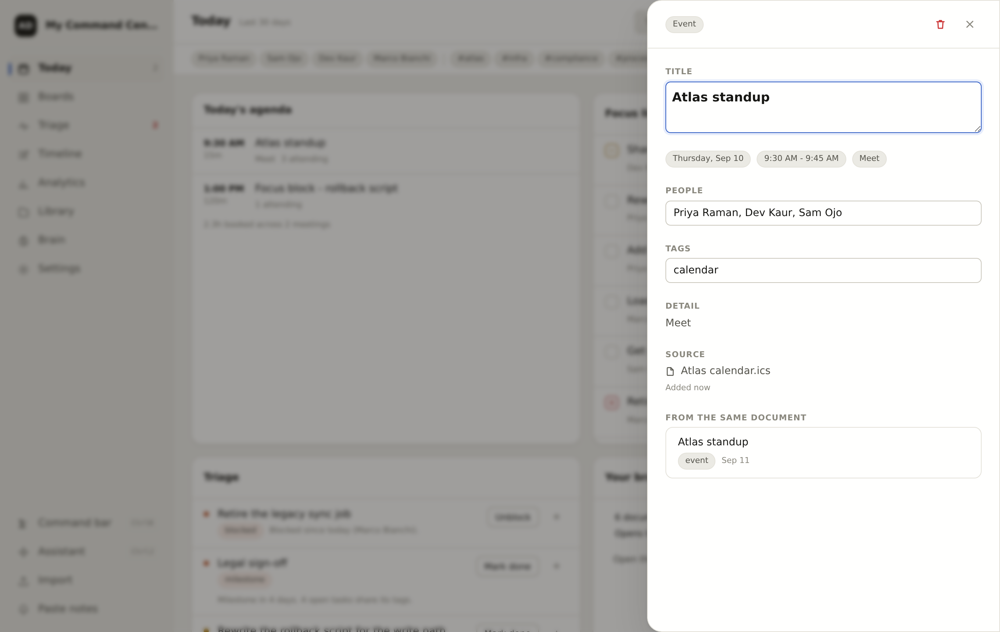
</p>

**Phone and dark mode.** Same app. The rail becomes a bottom tab bar, boards go
single-column, and the theme follows the OS or the toggle in Settings.

<p>
  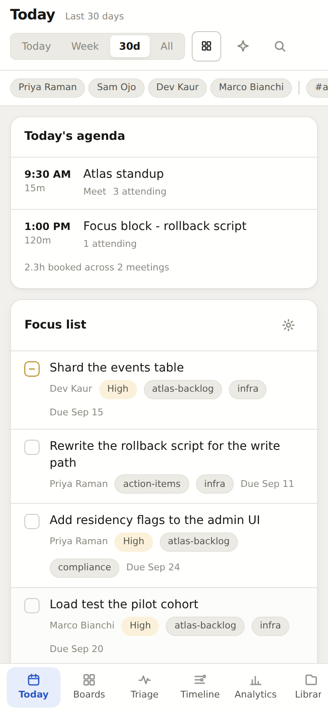
  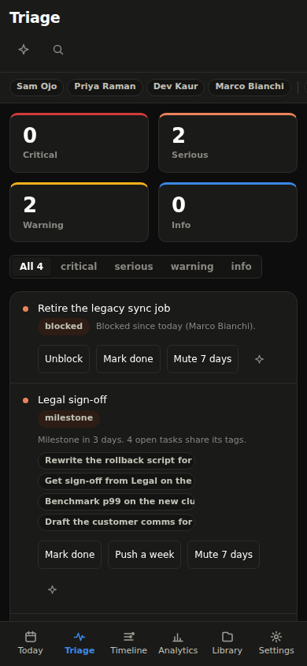
  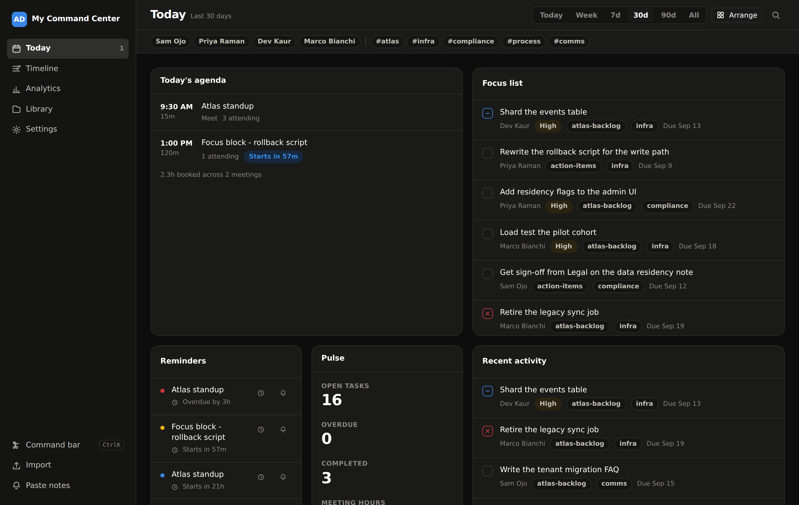
</p>

## The one idea

Everything becomes an **entity**: one flat record with a type, a title, optional
dates, people, tags and a value.

```js
{ id, type, title, body, at, end, due, status, priority,
  tags[], people[], value, unit, series, meta, source, confidence }
```

A meeting note, a calendar invite, a spreadsheet row and a hand-typed reminder all
normalise to that shape. Parsers only produce entities. Widgets only query them.
Neither knows the other exists.

That is why adding a file format costs one file, and adding a panel costs one
file, and neither costs a change anywhere else.

```
file ──▶ parser registry ──▶ entities ──▶ store ──▶ query layer ──▶ widgets
                                             │
                                             ├──▶ metric engine ──▶ charts
                                             ├──▶ reminder engine ──▶ notifications
                                             ├──▶ insight rules ──▶ "what needs attention"
                                             ├──▶ triage ──▶ worklist with actions
                                             └──▶ context builder ──▶ assistant ──▶ proposals
```

## What it reads

| Format | What comes out |
|---|---|
| `.md` `.txt` | Checkboxes, `Action:` / `Decision:` / `Risk:` / `Question:` lines, `Attendees:`, `## Timeline` sections, `Label: 42` metrics |
| `.vtt` `.srt` | Speaker turns, then commitments ("I'll rewrite the rollback script"), asks, decisions and stated worries |
| `.ics` `.ical` | Events with attendees, location and duration; recurrence expanded a year each way; action items hidden in invite descriptions |
| `.csv` `.tsv` | Task tables (owner, status, due, priority) or metric tables (a date column plus any numeric columns) |
| `.xlsx` `.xlsm` | Every sheet, via a 90-line ZIP reader over the browser's own `DecompressionStream`. No dependency |
| `.docx` | Headings, lists, checkboxes and tables, through the same ZIP reader, then read as notes |
| `.pptx` | Every slide's title and bullets, then read as notes |
| `.json` `.ndjson` | An exported workspace, an entity array, or any array of records treated as a table |
| `.html` | Flattened to text, then read as notes |

Exports from the tools people already use are recognised from their own headers
and read with that tool's quirks handled, with nothing to install or connect:
**Jira** and **Linear** CSV (summary, issue type, sprint, priority words),
**Asana** CSV (status from *Completed At*, section as a tag), **Todoist** CSV
(task rows only, priority 4 is urgent, *DATE* is the due date), **Trello** board
JSON (cards in lists, list names that read like a status become one, members
become owners), **GitHub** issues JSON (assignees and labels from objects,
milestone due dates), and Google, Outlook and Apple calendars. The Library shows
what was recognised. An unrecognised file still takes the generic route.

Dates are read the way people write them: `2026-03-04`, `by Friday`, `next
tuesday`, `Mar 20`, `3/20/26`, `EOD`, `in 2 weeks`. When it cannot tell, it
returns nothing rather than guessing.

A line like this:

```
- [ ] P0 Draft the launch brief @Sam #launch by Friday
```

becomes an open task titled "Draft the launch brief", owned by Sam, tagged
`launch`, urgent, due this Friday at 17:00 — with a link back to the file and
line it came from.

## The harness

Four registries, exposed on `window.AllDash`, so a plugin can be a single
`<script>` tag with no build step.

```js
AllDash.defineWidget({
  id: 'burn-rate',
  name: 'Burn rate',
  description: 'Spend against the month',
  category: 'Analytics',
  size: 'sm',
  render: ({ entityList, range, config, setConfig, onOpen }) => /* JSX */,
})

AllDash.defineParser({
  id: 'jira-csv',
  name: 'Jira export',
  extensions: ['.csv'],
  priority: 50,                       // highest matching priority wins
  match: ({ name, text }) => /Issue key/.test(text),
  parse: ({ name, text, buffer, docId }) => [/* entities */],
})

AllDash.defineMetric({
  id: 'wip',
  name: 'Work in progress',
  goal: 'down',
  compute: (entities, range) => ({ value, series }),
})

AllDash.defineCommand({ id: 'standup', name: 'Copy standup', run: ({ navigate }) => {} })
```

Register at any time — the board re-renders when a registry changes. Widgets
added by a plugin appear in the widget picker immediately. Settings → *The
harness* lists what is plugged in right now. A widget that throws gets its own
card saying so, with a button to reset its settings; the rest of the board
keeps rendering.

## Metrics

Three kinds, all the same shape downstream:

- **Built-in** — open tasks, overdue, completed, meeting hours, decisions, risks.
- **Discovered** — every numeric spreadsheet column becomes a queryable series on
  import. Nobody defines it. A discovered series has no known good direction, so
  its change is shown in neutral grey rather than guessed at as green or red.
- **Custom** — Settings → *Build a metric*: pick an entity type, a reducer
  (count/sum/avg/min/max/last), a date field, and optional tag or series filters.
  Live preview, then save. It shows up in every metric widget at once.

Every metric is evaluated against the window immediately before it, so the
headline delta is a real period-over-period comparison. A custom metric can
carry a **target**; the app reports progress and, from the fitted trend, how
many days until it is reached. Discovered series are checked pairwise for
correlation and the strongest pair is surfaced.

Analytics underneath: least-squares trend with an R², half-window momentum,
straight-line forecast, Pearson correlation, z-score anomalies, streaks, and
moving averages — about 100 lines in `src/core/query.js`, no dependency.

## Triage

Insights speak in sentences about the whole project. Triage speaks in rows about
single items, and it is a worklist rather than a report. Each row has a
severity, the reason it was raised, and the actions that clear it:

| Signal | Severity | Actions |
|---|---|---|
| Task past due | serious; critical when urgent or a week late | Mark done, Push a week |
| Task due in 48h | warning; serious when high priority | Mark done, Push a week |
| Blocked task | serious; critical after a week | Unblock, Mark done |
| In progress, untouched 14 days | warning | Mark done |
| Milestone within 14 days, or passed and not done | warning to critical, with the open tasks that share its tags | Mark done, Push a week |
| Open risk untouched 7 days | warning; serious after 21 | Mark done |
| Urgent task with no owner | warning | Assign |
| Two meetings overlapping in the next two days | warning | |
| Question open 14 days | info | |
| Custom metric off target with no trend toward it, or an unusual day | warning / info | |

Every row can be muted for a week. Mutes are the only thing stored; the signal
itself is derived on every render, so closing a task removes its row the
instant the store changes. The rail shows the count of critical and serious rows.

## Assistant

`⌘J` opens it. Every answer is grounded in a context block built from the live
store: a numeric snapshot, the metrics in the current window, what the rules
flagged, the top of triage, and up to forty items chosen by a small retriever
(matches for the question first, then the standing baseline: overdue, due this
week, blocked, open risks, today's meetings, milestones, recent decisions).
Items are printed with their ids, and the model is asked to cite them as
`[[id]]`; the panel turns each citation into a chip that opens the inspector.

The model cannot change anything. Asked to update, reschedule, assign, create
or close something, it emits a fenced `actions` block with a JSON array, and the
panel shows one proposal card per action with the before and after. Apply or
skip each one, or apply all. Unknown ids, bad statuses and unsupported ops are
dropped on the way in, so a model that invents an item cannot touch anything.

Three ways to reach a model, all plain `fetch` from the browser with streaming,
no SDK and no server in between:

| Provider | Endpoint | Key |
|---|---|---|
| Anthropic | Messages API, `claude-opus-5` by default | Your own key, sent straight to Anthropic |
| OpenAI-compatible | Anything speaking `/chat/completions`: OpenAI, Groq, OpenRouter, Mistral, LM Studio, vLLM, LocalAI | Bearer token |
| Ollama | `http://localhost:11434`, nothing leaves the machine | None; start Ollama with `OLLAMA_ORIGINS` set to this site |

The key lives in `sessionStorage` (gone when the tab closes) or, if you tick
*Remember on this device*, in `localStorage` under its own name. It is never part
of the workspace export. Two privacy dials: *What the model sees* can be titles,
dates, people and tags only, so no note or transcript text leaves the machine
even with a hosted model; and *Items per question* caps the context.

Voice is the browser's own speech APIs, no upload: a microphone button
transcribes into the box, *Read replies aloud* speaks the answer, and
*Hands-free* sends when you stop talking and listens again after the reply.
The buttons only render where the browser supports them.

The conversation lives in the panel and is gone when it closes. Nothing the
model says is stored unless you apply it.

## What needs attention

Rules that run over everything and return a sentence with its evidence attached.
Each finding lists the entities behind it, so you can click through and disagree.

Overdue work · tasks aging with no date · one person holding most of the open work
· heavy meeting weeks with the focus time left over · commitments with no owner ·
risks nobody has touched in a week · questions that never became decisions ·
metrics moving more than 35% across the window · daily closing streaks.

## Status update

The weekly message every team writes by hand is assembled from the store:
done, in progress, blocked and at risk, overdue, decisions, numbers that moved,
the next seven days, the calendar, open questions. Every line is a real entity;
nothing is invented. It is a widget on Today (copy or download as Markdown) and
a command (`Copy my status update`).

## Filters

Chips above a board scope it to a person or a tag. They are derived from what
is in the data, most common first. Widgets also take per-instance settings
from the gear in their header, generated from the `options` each widget
declares — a plugin widget gets that panel for free.

## Reminders

Derived, never stored. Anything with a due date or a start time produces one; the
store only keeps what you *did* about it (snoozed until, dismissed). Re-importing
a corrected calendar corrects the reminders too, with no reconciliation step.
System notifications are opt-in; the in-app list is always there.

## Design

Plain CSS, no framework. Tokens in `src/styles/tokens.css` are the single source
for colour, spacing, type and motion; light values sit on bare `:root`, dark
redefines only what changes under both the OS media query and an explicit theme
stamp, so the in-app toggle wins in both directions.

Charts are hand-drawn SVG. Series colours are a validated categorical palette:
adjacent-pair CVD ΔE ≥ 8, normal-vision ΔE ≥ 15. Marks are thin, the grid
recedes, there is exactly one y-axis, hover is on by default, and text always
wears an ink token rather than the series colour.

Mobile is the same app, not a cut-down one. The rail becomes a bottom tab bar,
boards go single-column, sheets slide up from the bottom, hit targets grow to
36–48px, and safe-area insets are respected.

## Keyboard

| | |
|---|---|
| `⌘K` / `Ctrl K` or `/` | Command bar — searches every entity and every command at once |
| `⌘J` / `Ctrl J` | Assistant |
| `g` then `t` `r` `l` `a` `d` `s` | Today, Triage, Timeline, Analytics, Library, Settings |
| `Esc` | Close whatever is open |

## Layout

```
src/
  core/       registry (the harness), store, query engine, time, format, ids
  data/       entity schema, the sample project
  ingest/     parser registry entry point, shared text and table readers, zip, export detection
  engine/     metrics, reminders, insight rules, triage
  ai/         providers (fetch + streaming), context builder, reply protocol, proposals, key storage
  ui/         shell, board, command bar, inspector, assistant, views, widgets, charts
  styles/     tokens, base, layout, components, viz
tests/        97 node:test cases over parsing, querying, analytics, triage and the assistant protocol
```

## Deliberately not here

No drag-and-drop grid library (buttons reorder widgets and work identically with a
mouse, a thumb and a keyboard). No state library — one object, one
`useSyncExternalStore`. No chart library. No router. No backend. No AI SDK: the
three providers differ by a URL, a header and a line format, and a single
line reader serves all of them. No model-driven writes: the assistant proposes,
a person applies. No PDF reading:
extracting text from PDFs without a dependency is unreliable, and shipping
something that half-works would be worse than saying so. Add it as a parser
plugin when you need it.

## Install it

The build ships a web manifest and a small service worker, so it installs to a
phone's home screen or a desktop dock and opens offline. The worker caches the
app shell only; there is no network traffic to cache.

## Storage

`localStorage`, under `all-dash:v1`. Export and restore as JSON from Settings →
*Your data*. Clearing site data clears the workspace, so export before you do
anything drastic.
